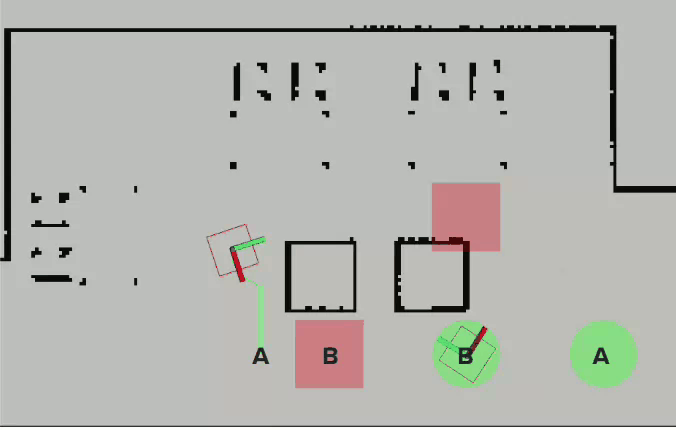
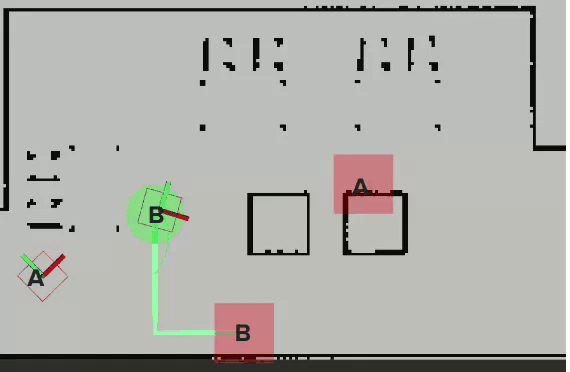

# ddg_multi_robot_planner

This repo contains CBS based ROS2 planner. The planner is based on the state of the art CBSH2-RTC mapf pllanner developed by [Prof. Jiaoyang Li](https://jiaoyangli.me/) and the original source code can be found [here](https://github.com/Jiaoyang-Li/CBSH2-RTC).

The work done here is part of a larger capstone project for [Team H (DockDockGo)](https://mrsdprojects.ri.cmu.edu/2023teamh/) doing their [Master's in Robotic Systems Development](https://mrsd.ri.cmu.edu/) at [The Robotics Institute, Carnegie Mellon University](https://www.ri.cmu.edu/). The work is sposored by [Manifacturing Futures Institute](https://engineering.cmu.edu/mfi/index.html). 

The lead contributors to this package are:
1. [Vineet Tambe](https://github.com/VineetTambe/)
2. [Jingtian Yan](https://github.com/JingtianYan/)

## Results: 
| Case | Gif |
|--------|-----|
| Smart planning to avoid collisions (2 Robots) |  |
| Avoiding collision by planning temporaly safe paths (2 Robots) | |
| Target Reasoning (4 Robots) | |
| Corridor Reasoning (4 Robots) | |
| Rectangle Reasoning + Target Reasoning (4 Robots) | |
| Avoiding collision by planning non conflicting paths (4 Robots) | |
| Avoiding collision by planning non conflicting paths (4 Robots) | |


## Paramters exposed in the launch file:

The parameter's that can be modified for the planner are exposed in the launch file:
1. `use_sim`: The Neobotix sim publishes the tf tranform for the base_link as `robot0base_link` in sim and `robot0/base_link` on the real robot - this param is meant to handle that.

2. `num_robots`: Number of robots to plan for - this param is primarily used for setting up the custom waypoint follower and is overwritten with size of the goal vector when a `/multi_robot_planner/get_plan` service request is received.

3. `use_inbuilt_waypoint_follower`: The package also has a rudimentary waypoint follower built for debugging purposes. 

4. `downsampled_map_file_path`: The file path to the downsampled map with the standard mapf format.

5. `downsampling_factor`: The factor by which the map is downsampled ex- 20x / 10x.

6. `original_origin`: The origin of the .pgm file -> used to compute the coordinate transform

7. `offset`: This is a tunable paramter to correct the coordinate transform to fine tune any round off issues caused due to downsampling.

8. `original_map_size`: The original map width and map height (in number of columns and rows) - this is again used to compute the coordinate transform.


## Instructions to run:

To generate the map file run the downsampling script in `scripts/costmap_downsampler_v2.py`

an example run command is: 
```
python your_script.py --map_file_path ~/mfi_maps/Oct-16/ --map_name Oct-16 --robot_footprint 0.6
```

The program expects a meta.yaml and .pgm file at the spcified location.


The resources and setup to run the planner as per the gif above in simulation can be found [in this repository](https://github.com/DockDockGo/mfi_multiagent_sim)
The planner can be launched by running:
```
ros2 launch ddg_multi_robot_planner multi_robot_planner.launch.py
```

The planner has the following interfaces exposed:

1. A get plan service: `/multi_robot_planner/get_plan`


The planner listens on the above service and has the message structure as per [GetMultiPlan.srv](https://github.com/DockDockGo/ddg_multi_robot_srvs/blob/main/srv/GetMultiPlan.srv).


Dummy service call to test out on the provided map:
```
ros2 service call /multi_robot_planner/get_plan \
  ddg_multi_robot_srvs/srv/GetMultiPlan \
  "{start: [
    {header: {stamp: {sec: 0, nanosec: 0}, frame_id: 'robot0'}, 
    pose: {position: {x: -1.5, y: -1.0, z: 0.0}, orientation: {x: 0.0, y: 0.0, z: 0.0, w: 1.0}}},
    {header: {stamp: {sec: 0, nanosec: 0}, frame_id: 'robot1'},
    pose: {position: {x: -1.5, y: 2.0, z: 0.0}, orientation: {x: 0.0, y: 0.0, z: 0.0, w: 1.0}}
  }],
  goal: [
    {header: {stamp: {sec: 0, nanosec: 0}, frame_id: 'robot0'},
    pose: {position: {x: 15.0, y: 2.0, z: 0.0}, orientation: {x: 0.0, y: 0.0, z: 0.0, w: 1.0}},
    {header: {stamp: {sec: 0, nanosec: 0}, frame_id: 'robot1'},
    pose: {position: {x: 15.0, y: -2.0, z: 0.0}, orientation: {x: 0.0, y: 0.0, z: 0.0, w: 1.0}}
  ]}"
```

The expected response is a path for every agent and a bool indicating whether the planner succeeded or not.
The paths are as per the indices in the original start and goal vectors.

This serivice unlike the rest of the package is not limited by the number of robots! And can plan for any number of robots as long as they have valid start and goal locations!

2. A go to goal service: `"/multi_robot_planner/go_to_goal_cbs` -> this is needs to be enabled by setting the `use_inbuilt_waypoint_follower` param in the launch file to True.

The planner listens on the above service and has the message structure as per [GoToGoal.srv](https://github.com/DockDockGo/ddg_multi_robot_srvs/blob/main/srv/GoToGoal.srv).

Sending a goal location on this service will plan a path and will send waypoint to the robot (as per the index - robot selected = robot0, robot1) until it reaches the target goal location. It will replan in case the A* planner reroutes the robot - this adds a pseudo-dynamic obstacle avoidance behaviour to the planner.

This service as of now is only limited to 2 robots.

Dummy call to the service on map `/src/ddg_multi_robot_planner/maps/downsampled-map/res20/svd_demo-downsampled.map`:
```
ros2 service call /multi_robot_planner/go_to_goal_cbs \
  ddg_multi_robot_srvs/srv/GoToGoal \
  "{goals: [
    {header: {stamp: {sec: 0, nanosec: 0}, frame_id: 'robot0'}, 
    pose: {position: {x: 15.0, y: -2.0, z: 0.0}, orientation: {x: 0.0, y: 0.0, z: 0.0, w: 1.0}},
    {header: {stamp: {sec: 0, nanosec: 0}, frame_id: 'robot1'},
    pose: {position: {x: 15.0, y: 2.0, z: 0.0}, orientation: {x: 0.0, y: 0.0, z: 0.0, w: 1.0}}
  ]}"

```

3. A goal topic: The planner also listens on the ros2 topic for goal pose for individual robot (but won't start execution until a valid goal pose for both the robot is received atleast once):
```
/<agent_name>/cbs_path/goal_pose"
```
And expects the following a `geometry_msgs::msg::PoseStamped` message in the request.

Upon receiving data on this topic the planner will add the agent and goal to a vector that is maintained internally.
This datastructure is passed to the underlying CBS planner.

An implementation of the publisher which publishes target poses for the above planner to plan can be found here:
1. [multi_navigator](https://github.com/DockDockGo/multi_navigator/tree/cbs_navigator) ros2 package.

Other additional packages that are used in ddg_multi_robot_planner are:
1. [ddg_multi_robot_srvs](https://github.com/DockDockGo/ddg_multi_robot_srvs) - contains srv files for all the custom services used internally by ddg_multi_robot_planner 